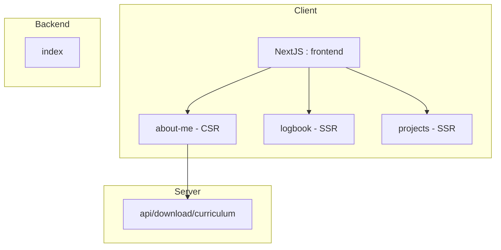

# Caravel

## Introduction :

_What is this project about ?_

- This project is a my personal blog where you can find :
  - Public article where i write about software engineering (Pattern, Tools, Architecture, Product, Management, etc..)
  - Links to my personal projects
  - Information regarding myself (Curriculum vitae, hobbies, etc..)

## How to run ? :

There is 2 ways of running the project :

### 1️⃣ Use a `devcontainer` (prefered way):

In order to use [devcontainer](https://code.visualstudio.com/docs/devcontainers/containers) the requirements are :

- [docker](https://www.docker.com/)
- [visual studio code](https://code.visualstudio.com/)
- [dev container extension](https://marketplace.visualstudio.com/items?itemName=ms-vscode-remote.remote-containers)

Once the requirements are installed, open this repository using vscode.

It should :

- Open it inside a `container`
- Install the project
- Run the frontend under port `3000`

Open [http://localhost:3000](http://localhost:3000)

- Run the backend under port `3001`

Open [http://localhost:3001](http://localhost:3001)

### 2️⃣ Basic installation

On the root of the project

Run :

- `pnpm install -r`
- `pnpm dev`
- Open [http://localhost:3000](http://localhost:3000)
- Open [http://localhost:3001](http://localhost:3001)

## Technologies

_What technologies are you using ?_

### Frontend

This project uses :

- `NextJS` has a metaframework
- `Tailwind` for the styling

#### Blog

In order to run the blog i use the `mdx` format with plugins `rehype, retype`. I use the `contentlayer` library to manage the content.

#### Hosting

The hosting is managed by vercel :

- The file serving is DONE using `lambda` functions

### Bakckend

This project uses :

- `Hono` has a server framework

## Architecture

